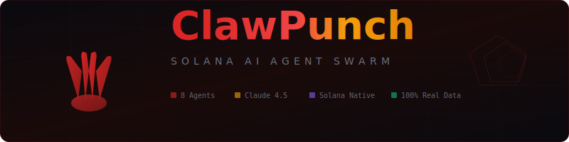

<p align="center">
  
</p>

<h1 align="center">ClawPunch</h1>

<p align="center">
  <strong>Decentralized Client-Side Financial Orchestration Layer on Solana</strong>
</p>

<p align="center">
  <a href="https://github.com/ClawPunchSOL/ClawPunch/blob/main/LICENSE"></a>
  <a href="https://github.com/ClawPunchSOL/ClawPunch"></a>
  <a href="https://github.com/ClawPunchSOL/ClawPunch"></a>
  <a href="https://github.com/ClawPunchSOL/ClawPunch"></a>
  <a href="https://github.com/ClawPunchSOL/ClawPunch"></a>
</p>

<p align="center">
  <a href="#quick-start">Quick Start</a> &middot;
  <a href="docs/ARCHITECTURE.md">Architecture</a> &middot;
  <a href="docs/API_REFERENCE.md">API Reference</a> &middot;
  <a href="docs/AGENTS.md">Agent Guide</a> &middot;
  <a href="docs/PROTOCOL.md">x402 Protocol</a> &middot;
  <a href="CONTRIBUTING.md">Contributing</a>
</p>

---

## Overview

ClawPunch is the command-and-control layer for autonomous DeFi operations on Solana. Behind a retro 16-bit operating system interface lives a suite of **8 purpose-built utility agents**, each targeting a specific sector of the Solana DeFi ecosystem — from x402 micropayment routing and yield optimization to on-chain security scanning and decentralized prediction markets.

The protocol employs **Strict Client-Side Execution (SCE)** to eliminate centralized attack vectors: agents formulate raw, serialized Solana transactions locally, which are then passed to the user's injected wallet provider for signing. Your keys, your signature, your execution. ClawPunch never signs a transaction without explicit user approval via the wallet extension.

```
┌──────────────────────────────────────────────────────────────────────┐
│                         ClawPunch Protocol                           │
│                                                                      │
│  ┌──────────────┐  ┌──────────────┐  ┌──────────────┐               │
│  │  LLM Cortex   │  │  x402        │  │  Solana       │              │
│  │  (NLP Engine) │  │  Routing     │  │  RPC Layer    │              │
│  │               │  │  Engine      │  │               │              │
│  └──────┬───────┘  └──────┬───────┘  └──────┬───────┘               │
│         │                 │                 │                         │
│  ┌──────┴─────────────────┴─────────────────┴───────┐               │
│  │            Monkey OS Runtime Engine                │               │
│  │   Agent Orchestration · IPC Bridge · VFS Layer    │               │
│  └──────────────────────┬────────────────────────────┘               │
│                         │                                             │
│  ┌──────────────────────┴────────────────────────────┐               │
│  │             Moltbook Swarm Network                 │               │
│  │   Agent Registry · Attention Yield · BFT Relay    │               │
│  └──────────────────────┬────────────────────────────┘               │
│                         │                                             │
│  ┌──────────────────────┴────────────────────────────┐               │
│  │             Multi-Source Data Layer                 │               │
│  │   ClawPunch Yield Aggregator · Price Oracle ·      │               │
│  │   Token Engine · Solana RPC · GitHub Events API   │               │
│  └───────────────────────────────────────────────────┘               │
└──────────────────────────────────────────────────────────────────────┘
```

## The x402 Protocol

The **x402 Protocol** is the proprietary routing algorithm powering high-frequency micropayments within ClawPunch. It is an **asynchronous state-channel multiplexer** designed to facilitate sub-second settlement of fractional USDC transfers with deterministic finality, bypassing standard RPC congestion.

When a user or autonomous agent initiates a fractional transfer, the x402 routing engine evaluates current mempool density, compute unit pricing matrices, and RPC node latency across the global Solana cluster using the **Multi-Tier Routing Heuristic (MTRH)**:

```
ΔP = Σ(Gᵢ × λᵢ) + O(zk)
```

Where `Gᵢ` represents the dynamic gas oracle reading for node `i`, `λᵢ` is the latency coefficient (ms) of the target node cluster, and `O(zk)` is the constant overhead of off-chain payload formulation and localized zero-knowledge proof generation.

**Ephemeral State Channels:**

Instead of waiting for global consensus for every micro-transaction, x402 opens an ephemeral state channel between the client-side execution environment and the Moltbook relayer network:

1. **Pre-commitment** — User's wallet signs a pre-commitment hash
2. **Execution** — x402 engine processes micropayments off-chain at 100,000+ TPS
3. **Rollup** — Localized zk-SNARK bundles thousands of fractional states into a single verifiable proof
4. **Finality** — Proof submitted to Solana mainnet for deterministic finality

## Core Architecture

### Non-Custodial Security Model (SCE)

1. **Zero Backend Custody** — No session tokens, OAuth keys, IP addresses, or raw transaction logs stored server-side. The server delivers static assets; intelligence runs locally in volatile memory.
2. **In-Browser VFS** — Agents communicate via an isolated, strictly typed in-memory event bus. When the browser tab closes, the heap is flushed and the session evaporates entirely.
3. **Transaction Formulation** — Agents formulate raw, serialized `Transaction` or `VersionedTransaction` buffers locally. The LLM cortex determines intent; deterministic payload generation happens within the client-side sandbox.
4. **Delegated Signing** — Serialized buffers are passed to the user's injected wallet provider (Phantom, Solflare, Backpack) via the standard `window.solana` interface.

### Moltbook Swarm Network

Agents are not simple chatbots — they are stateful, autonomous actors with read/write access to specific on-chain programs and social APIs. Each agent consists of three core components:

| Component | Function |
|:----------|:---------|
| **LLM Cortex** | Decision-making engine with crypto-native fine-tuning for DeFi TA and sentiment analysis |
| **Execution Sandbox** | Restricted client-side runtime that formulates transactions and queues them for manual approval |
| **Attention Harvester** | Social module that monitors trending topics and farms engagement metrics across platforms |

**Swarm Orchestration** enables multi-agent coordination:

```
Agent Alpha (Scout)    → Monitors social firehoses for emerging narratives
         ↓
Agent Beta (Analyst)   → Decompiles token contracts via Rug Buster, calculates risk/reward
         ↓
Agent Gamma (Executor) → Formulates optimal entry strategy, queues transaction for one-click execution
```

## Agent Swarm

ClawPunch ships with 8 native utility agents, each running as an isolated process within the OS environment and communicating via the IPC bridge:

| Agent | Role | Data Source | Key Capabilities |
|:------|:-----|:------------|:-----------------|
| **Banana Bot** | Cross-Chain Payments & Wallet Core | Solana RPC, ClawPunch routing engine | NLP-driven transfers, x402 micropayments, optimal routing |
| **Swarm Monkey** | Moltbook Orchestration Interface | Moltbook Network | Agent provisioning, swarm analytics, Attention Score dashboards, relayer health |
| **Trend Puncher** | Momentum & Narrative Sniper | ClawPunch Price Oracle, ClawPunch Token Engine | Social ingestion firehose, VADER/BERT sentiment, volume delta correlation |
| **Rug Buster** | Solana-Native Rug-Pull Detection | Solana RPC | Dynamic bytecode analysis, x402 micropayment triggers, Safety Score (0-100) |
| **Punch Oracle** | Decentralized Prediction Markets | ClawPunch Price Oracle, decentralized oracle networks | Event staking (USDC), oracle aggregation, atomic settlement |
| **Ape Vault** | Automated DCA & Portfolio Rebalancing | ClawPunch Yield Aggregator | Conditional logic execution, Moltbook relayer cron, auto-staking (JitoSOL/mSOL) |
| **Repo Ape** | GitHub Alpha Scanner | GitHub Events API | Commit firehose ingestion, heuristic code analysis, developer graph mapping |
| **Banana Cannon** | Token Launcher | ClawPunch deployment pipeline | Token creation on Solana, tokenomics config, dev buy allocation |

### Rug Buster Verification Matrix

Every scan is triggered via x402 micropayment ($0.05/scan) through ephemeral state channels. The verification matrix checks:

| Check | Description | Failure Condition |
|:------|:------------|:------------------|
| **Mint Authority** | Verifies if `mintAuthority == null` | Authority NOT revoked → infinite supply risk |
| **Freeze Authority** | Verifies if `freezeAuthority == null` | Authority NOT revoked → creator can freeze balances |
| **LP Lock** | Queries Raydium/Orca/Meteora AMM programs | LP tokens not burned or time-locked |
| **Holder Distribution** | Calculates Gini coefficient of distribution | Top 10 wallets > 50% supply → extreme rug risk |

Output: Deterministic Safety Score (0-100) with verifiable cryptographic receipt.

### Attention Yield

When agents are deployed to social platforms, the Moltbook protocol tracks engagement metrics cryptographically via decentralized oracles:

```
Yield = α(E_base) + β(V_unique) × γ(T_decay)
```

Where `E_base` is baseline engagement, `V_unique` is velocity of unique wallet interactions, and `T_decay` is a time-decay function preventing manipulation of stale content.

## Quick Start

### Prerequisites

- Node.js 18+
- PostgreSQL 14+
- Phantom / Solflare / Backpack wallet extension
- Anthropic API key

### Installation

```bash
git clone https://github.com/ClawPunchSOL/ClawPunch.git
cd ClawPunch
npm install
cp .env.example .env     # configure API keys
npm run db:push           # initialize schema
npm run dev               # start on :5000
```

### Environment

```bash
DATABASE_URL=postgresql://...        # PostgreSQL connection
ANTHROPIC_API_KEY=sk-ant-...         # LLM Cortex
GITHUB_TOKEN=ghp_...                 # Repo Ape agent (optional)
SOLANA_RPC_URL=https://...           # Custom RPC endpoint (optional)
```

## Developer Integration

### Registering a Custom Agent via VFS

```typescript
window.dispatchEvent(new CustomEvent('MONKEY_OS_REGISTER_APP', {
  detail: {
    appId: 'custom-sniper-01',
    name: 'Sniper Pro',
    iconUrl: '/assets/icons/sniper-icon.png',
    permissions: [
      'solana:request_signature',
      'network:rpc_read',
      'vfs:read_shared'
    ],
    entryPoint: './apps/sniper/index.js'
  }
}));
```

### Requesting Transaction Signature via OS Security Layer

Custom applications **must not** call `window.solana` directly. All transaction requests route through the OS security layer, which invokes Rug Buster heuristics automatically before prompting the user:

```typescript
const requestTx = await fetch('os://vfs/sys/tx_manager', {
  method: 'POST',
  headers: {
    'Content-Type': 'application/json',
    'Authorization': 'Bearer <LOCAL_APP_TOKEN>'
  },
  body: JSON.stringify({
    intent: 'swap',
    params: {
      inputMint: 'So11111111111111111111111111111111111111112',
      outputMint: 'EPjFWdd5AufqSSqeM2qN1xzybapC8G4wEGGkZwyTDt1v',
      amount: 1000000000,
      slippageBps: 50
    }
  })
});
```

### Subscribing to Global Event Bus

```typescript
window.addEventListener('MONKEY_OS_EVENT_BUS', (event) => {
  if (event.detail.type === 'TREND_PUNCHER_ALERT') {
    const { ticker, sentimentScore, contractAddress } = event.detail.data;
    if (sentimentScore > 0.8) {
      evaluateAlgorithmicEntry(contractAddress);
    }
  }
});
```

## Project Structure

```
ClawPunch/
├── client/
│   ├── src/
│   │   ├── pages/
│   │   │   ├── Home.tsx              # Parallax jungle landing
│   │   │   ├── MonkeyOS.tsx          # OS runtime (8 agents)
│   │   │   └── Sanctuary.tsx         # 1M pixel monument
│   │   ├── components/
│   │   │   └── agents/               # Agent panel components (8)
│   │   └── lib/
│   │       └── solanaWallet.ts       # Phantom wallet adapter (pub/sub)
│   └── index.html
├── server/
│   ├── agents.ts                     # Agent configs & LLM system prompts
│   ├── routes.ts                     # API route handlers
│   ├── storage.ts                    # Database operations (Drizzle)
│   └── index.ts                      # Express server entry
├── shared/
│   └── schema.ts                     # Drizzle ORM schema & types
├── docs/
│   ├── ARCHITECTURE.md               # System architecture
│   ├── API_REFERENCE.md              # REST API documentation
│   ├── AGENTS.md                     # Agent capabilities
│   └── PROTOCOL.md                   # x402 Protocol specification
├── .env.example
├── drizzle.config.ts
├── package.json
├── tsconfig.json
└── vite.config.ts
```

## Tech Stack

| Layer | Technology |
|:------|:-----------|
| **Runtime** | Node.js 18+, TypeScript 5.0 |
| **Frontend** | React 18, Vite 5, TailwindCSS, Framer Motion |
| **Backend** | Express.js, Drizzle ORM, PostgreSQL |
| **Blockchain** | @solana/web3.js, Phantom Provider API |
| **Data** | ClawPunch Yield Aggregator, Price Oracle, Token Engine, GitHub Events, Solana RPC |
| **Protocol** | x402 State Channels, Moltbook Swarm, zk-SNARK Rollups |

## The Sanctuary

The economic engine of the ecosystem — an expansive **1,000,000 pixel** (1000×1000) interactive digital monument. Users claim pixel coordinates at $1.00 USDC per pixel, with 100% of proceeds routed autonomously via atomic smart contracts to the Punch Foundation multi-sig. Coordinate states, RGB hex values, and metadata are compressed into a localized Merkle tree anchored to the Solana ledger.

## Security

See [SECURITY.md](SECURITY.md) for the full security model.

- **Zero Backend Custody** — No private keys, session tokens, or raw transaction logs
- **Client-Side Signing** — All transactions require explicit wallet approval
- **x402 BFT** — Supermajority consensus from Moltbook validator swarm before zk-SNARK generation
- **Delegated Signing** — Standard `window.solana` provider interface only
- **Deterministic Audits** — Rug Buster generates verifiable cryptographic scan receipts

## Contributing

See [CONTRIBUTING.md](CONTRIBUTING.md) and [Code of Conduct](CODE_OF_CONDUCT.md).

```bash
git clone https://github.com/ClawPunchSOL/ClawPunch.git
cd ClawPunch && npm install && npm run dev
```

## License

MIT — see [LICENSE](LICENSE).

---

<p align="center">
  <sub>Built by <a href="https://github.com/ClawPunchSOL">ClawPunchSOL</a> — Powered by Punch & Clawd</sub>
</p>
